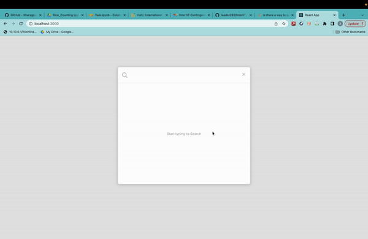

# Getting Started with Smooth Search App

This application provides a search bar that can search smoothly and fast enough from a json file hosted on a node api endpoint. The whole application is dockerized and hence the app can be set up in just 4 easy steps!!

## Prerequisites

For using this app the following prerequisites are required:

### `npm`

### `node`

Install the above two from [here](https://docs.npmjs.com/downloading-and-installing-node-js-and-npm) and make sure they are installed using npm -v and node -v command

### `docker`

Download docker form [here](https://www.docker.com/) and then install and open it to get the docker deamon runing

### `git`

Git should be installed on your system

## Steps to start the application

* Clone the repository into your local machine using `git clone https://github.com/leader282/InterIIT-Dev-Team-Task.git`

* Move into the smoothsearch directory using `cd smoothsearch` and then run `npm i`

* Come out from smoothsearch using `cd ..` and then move into the backend directory using `cd backend` and then run `npm i`

* Come out from backend using `cd ..` and then run `docker-compose up -d --build`

* Once the application is running we should get a message for both frontend and backend done and then run `docker-compose ps` to get the state `Up` from both frontend and backend along with ports on which they are running. You can also see the images and container being created in the docker desktop app

## Features of the application and how to use it

The application will be deployed at `http://localhost:3000` and there would be a searchbar present. Typing in the searchbar shows relevant links containing the keywords being searched along with that particular query being highlighted in the links being displayed. Clicking on the cross or outside the searchbox closes it.

## Preview

